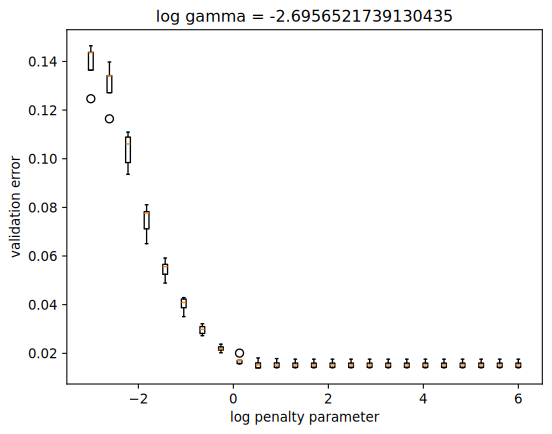
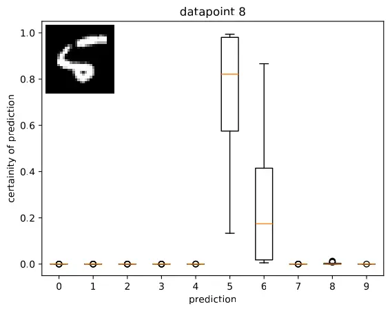

# Multiple Nodes of GPUs Examples in Machine Learning

Sherman Lo 2023-24

Queen Mary, University of London

These are some exercises and implementations to use multiple nodes of GPUs

## Case Studies

The dataset used is the MNIST dataset, available in
[`torchvision`](https://pytorch.org/vision/main/generated/torchvision.datasets.MNIST.html).

### Grid Search and SVM

A GPU implementation of an SVM is available in
[RAPIDS' `cuML`](https://docs.rapids.ai/api/cuml/stable/). The exercise is to
implement a grid search to tune the parameters `C` and `gamma`. This can be
parallelised by splitting the search space between GPUs and nodes.

This is implemented in `mnist_svm`.



Figure 1: A box plot of validation errors for a fixed `gamma` when fitting a
`cuml.svm.SVC` on the MNIST dataset. The box plot captures the 5 validation
errors from 5-fold cross-validation. The minimum is somewhere around
`C=math.log(1.3, 10)`.

### Bagging and Neural Networks

A [PyTorch](https://pytorch.org/) neural network `Net` is defined in
`mnist_nn/model.py` and can be trained using the optimiser `torch.optim.SGD`
with loss function `torch.nn.CrossEntropyLoss()`.

The exercise is to implement bagging and random search to tune and quantify the
uncertainty of the neural network's parameters `n_conv_layer`, `kernel_size`
`n_hidden_layer` and the optimiser's parameters `lr` and `momentum`. This can
be parallelised by distributing the bootstrap samples, or a seed, between GPUs
and nodes.

This is implemented in `mnist_nn`.



Figure 1: Box plot of the certainty of each model's prediction of each digit.
The handwriting to predict is shown on the top left.

### Parallel Strategies

A hybrid approach was implemented here, using both `multiprocessing`, to use
multiple GPUs on a node, and `mpi4py`, to use multiple nodes.

In the single node case, having MPI and `mpi4py` installed is optional.

In the multiple node case, it is required to execute `python` with MPI. This
can be done with commands such as `mpirun` and `srun`. You must allocate a
process per node. This can be done, for example:

- For OpenMPI, supply the option `--map-by ppr:1:node`
- For IntelMPI, supply the option `-ppn 1`
- On Slurm, supply the option `#SBATCH --ntasks-per-node=1`

## Getting Started

The `pip` requirement files are available in `requirements-cu*.txt` where the
suffix is the CUDA version. For example `requirements-cu11.txt` for CUDA 11.
These packages can be installed, for example in a virtual environment, using
for example

```shell
pip install -r requirements-cu11.txt
```

Run `python mnist.py` to download the data.

### Reproducibility

The requirements file `requirements-pin.txt` has pinned versions should you
wish to exactly reproduce results on the blog. Furthermore, Python 3.10.7 was
used on Apocrita, Python 3.10.4 on Sulis.

### `mnist_svm`

If you wish to you multiple nodes, use, for example, `mpirun` as explained
previously.

```text
python -m mnist_svm [-h] [--gpu GPU] [--batch BATCH] [--results RESULTS] n_tuning

positional arguments:
  n_tuning           Number of tuning parameters

options:
  -h, --help         show this help message and exit
  --gpu GPU          What GPUs to use. Indicate individual GPUs using integers separated by
                     a comma, eg 0,1,2. Or provide 'all' to use all available GPUs. Defaults
                     to device 0
  --batch BATCH      Number of tuning parameters to validate for a worker before a new one
                     instantiates. Defaults to no re-instantiation
  --results RESULTS  Where to save figures and results, defaults to here
```

### `mnist_nn`

If you wish to you multiple nodes, use, for example, `mpirun` as explained
previously.

```text
python -m mnist_nn [-h] [--gpu GPU] [--results RESULTS] [--seed SEED] n_bootstrap n_tuning

positional arguments:
  n_bootstrap        Number of bootstrap samples
  n_tuning           Number of tuning parameters to search

options:
  -h, --help         show this help message and exit
  --gpu GPU          What GPUs to use. Indicate individual GPUs using integers separated by
                     a comma, eg 0,1,2. Or provide 'all' to use all available GPUs. Defaults
                     to device 0
  --results RESULTS  Where to save figures and results, defaults to here
  --seed
```

### Apptainers

Apptainers definition files `requirements-cu*.def` are provided too if you would
like to use a container. They can be built, using for example

```shell
apptainer build container-cu11.sif requirements-cu11.def
```

and run using

```shell
apptainer run --nv container-cu11.sif [OPTIONS]
```

where `[OPTIONS]` are options and commands you would usually put after `python`.

It may be tricky if you require to run MPI with these containers, please refer
to the [Apptainer manual](https://apptainer.org/docs/user/latest/mpi.html).

### Reducing Code For Testing

If you would like to run small tests to verify the code works, please see the
suggestions below.

- `mnist_svm`
  - Run for a small grid, eg `python -m mnist_svm 1`
- `mnist_nn`
  - Run for fewer bootstrap samples and search less, eg `python -m mnist_nn 1 1`
  - You can reduce the number of iterations of the dataset when doing stochastic
    gradient descent. In `mnist_nn/train.py`, you can reduce `N_MAX_EPOCH` to
    something small, eg `N_MAX_EPOCH = 1`
  - You can reduce the number of epochs used in stochastic gradient descent. In
    `mnist_nn/train.py`, see the function `train_model()`. The loop `for data in
    data_loader:` iterates for each epoch.
  - You can reduce the complexity of the neural network when doing random
    search. You can modify the distribution of the tuning parameters by
    modifying the function `random_parameter()` in `mnist_nn/model.py`
